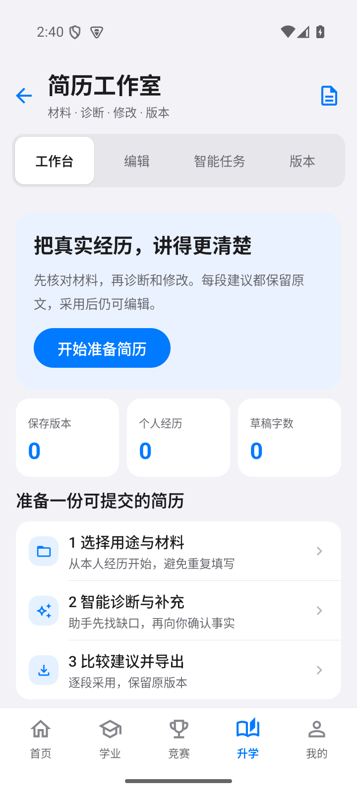
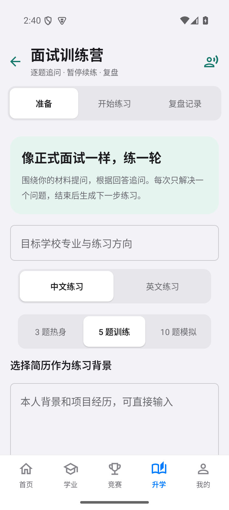

> 2.2 智能工作台阶段交付：独立简历与面试、持久智能任务、赛事来源档案、资料阅读和账号空间隔离。见 [使用说明](docs/2.2使用说明.md) 与 [Word 方案对照和真实测试](docs/2.2方案对照与测试.md)。综测保持冻结；报告中的未完成项在对照表明确列出。

# 青理竞赛通

## 最新版 2.2 · 智能工作台

- [下载 Android 安装包 v2.2.0](downloads/青理竞赛通-v2.2.0.apk)（Android 8.0 及以上，沿用原签名，可覆盖安装）
- [2.2 中文使用说明](docs/2.2使用说明.md)
- [Word 方案完成情况与测试](docs/2.2方案对照与测试.md)
- [仅 API 的部署配置](docs/agent-compose.yaml)

简历工作室和面试训练营使用独立页面。简历支持材料核对、诊断追问、逐段修改、事实复核、版本与 Word/PDF 导出；面试支持基于本人材料连续追问、进度恢复与整轮复盘。首页提供智能任务中心和全局搜索，任务在服务端保存，支持中途取消和失败步骤续跑。

赛事中心连接目录、来源、通知、关注提醒、组队、经验和资料；84 项均有独立来源档案，其中 11 项已完成此次核验，其余明确标为待核验或历史来源。资料支持原版 PDF 预览、文字检索、阅读位置和版本。成绩导入新增可撤销快照，本机工作台按账号和服务器身份隔离。

这是一份阶段版本，Word 方案尚未全部完成。其余赛事官网核验、跨来源事件归并、语音面试、OCR、私有团队资料及真实打印订单等仍需后续开发，具体以对照清单为准。综测在 2.2 升级期间保持冻结；本次提交也包含此前已交付的学生工作台基础与教务预览代码，以保留完整可构建源码。

已有验证：后端 51 项、安卓计算单元测试 6 项、模拟器流程 9 项通过；发布 APK 签名验证和覆盖安装通过。真实模型联调完成简历五阶段和三题面试。测试范围及首次联调失败记录见测试说明。

 

游客可浏览公开信息并使用本机工具；云端任务、私人文件、同步与参与社区需要邮箱登录。邮箱登录不等于学校身份认证。平台不会自动公开私人材料或代替用户报名、支付。

本仓库提供源码、公开安装包和说明，不包含服务器密码、模型密钥、运行数据库或发布签名私钥。私人完整交付 ZIP 不应上传到公开仓库。

旧版资料：[v1.0 APK](downloads/青理竞赛通-v1.0.0.apk) · [v1.2 APK](downloads/青理竞赛通-v1.2.0.apk) · [历史使用说明](docs/使用说明.md)。以下保留原项目开发与部署说明，2.2 使用方式优先参照新版说明。

## 项目结构

- `android/`：Kotlin、Jetpack Compose、Room、DataStore、WorkManager 安卓工程。
- `backend/`：FastAPI、SQLite、定时官网采集、解析测试与真实页面样本。
- `zhcp/`：综测独立若依风格 Java 后端（学工/教务登录、规则包、DeepSeek 视觉审真伪）。
- `zhcp-ui/`：团支书 Vue3 管理端。
- `compose.yaml`：竞赛通知与综测两套容器；不要改动服务器上已有的 `ruoyi-admin-docker`。

## 安卓开发与构建

需要 JDK 17、Android SDK Platform 35 / Build Tools 35.0.0。Android Studio 打开 `android` 文件夹即可。Gradle Wrapper 固定为 8.11.1，AGP 为 8.9.2，Kotlin 为 2.1.20；依赖使用固定版本并配置 Maven 镜像以改善下载可用性。

```powershell
cd android
./gradlew.bat assembleDebug
./gradlew.bat lintDebug
```

Linux/macOS 可使用 `bash gradlew assembleDebug`。如未通过 Android Studio 配置 SDK，请设置 `ANDROID_HOME`，或在 `android/local.properties` 中指定 `sdk.dir`。

正式发布时，将独立签名备份包中的 `qingli-release.jks` 和 `signing.properties` 复制至 `android` 根目录，然后运行：

```powershell
./gradlew.bat assembleRelease
```

APK 位于 `android/app/build/outputs/apk/release/app-release.apk`。签名配置缺失时不会自动用调试签名冒充发布签名。升级时保持应用 ID `cn.qingli.competition` 和原签名，递增 `versionCode`。

Android 8.0（API 26）及以上可安装。默认服务地址在 `Data.kt` 的 `DEFAULT_SERVER` 中，也可在安装后的设置页面修改；地址验证成功后才保存。首次同步不推送历史通知，后台轮询默认间隔一小时，实际运行由安卓系统调度。收藏、已读和自定义日期保存在独立 Room 表中，官网更新不会覆盖它们。

## 后端部署

在已经安装 Docker 与 Docker Compose 的 Linux 服务器上，将本目录复制到 `/opt/qut-competition`：

```sh
cd /opt/qut-competition
docker-compose -p qut-competition -f compose.yaml up -d --build
curl http://127.0.0.1:18086/health
```

若系统使用 Compose 插件，将命令中的 `docker-compose` 替换成 `docker compose`。对外开放 TCP 18086 即可。综测 API 为 18088，团支书管理端为 18089。竞赛通知 API 只读；综测登录走学工/教务校验，校园密码 AES 加密落库且接口不回传明文。该版本通过 HTTP 传输；可在现有反向代理中增加 HTTPS 后修改 App 服务地址。

```sh
# 只构建综测（不影响已在跑的竞赛通 FastAPI）
docker compose -p qut-competition -f compose.yaml up -d --build zhcp-api zhcp-ui
curl http://127.0.0.1:18088/health
```

服务会在启动时自动同步，第一次约需一至两分钟，之后每小时扫描最新两页、每天北京时间 05:15 复查未到截止的通知。首次扫描约 100 条；列表上的已撤销页面跳过，图片或附件形式的通知正常收录。官网不提供完整中间证书链，项目补充从证书颁发机构取得的中间证书，保留正常的 TLS 主机名和根证书验证。

QQ 竞赛群由 NapCat 采集。群消息先做关键词正则预筛，再每 15 分钟调用 DeepSeek 复核；判定为竞赛通知后写入同一通知库，可在 App 中按“QQ群”筛选查看。复制 `.env.example` 为 `.env`，填写 `DEEPSEEK_API_KEY` 和 `NAPCAT_TOKEN`。本机若已有 NapCat 容器，后端默认通过 `host.docker.internal:3000` 调用它，无需再起一套。全新服务器可用 `docker compose --profile bundled-napcat up -d` 一并启动。打开 `http://<服务器>:6099/webui` 扫码登录机器人 QQ，再把该账号拉进竞赛通知群。`QQ_GROUP_IDS` 可限制只听指定群，多个群号用逗号分隔；留空则监听机器人所在的全部群。

```sh
# 拉取 QQ 群最近消息并审核待确认条目
docker exec qut-competition-api python -m app.manage qq-poll
docker exec qut-competition-api python -m app.manage qq-review
```

```sh
# 查看运行状态、日志
docker ps --filter name=qut-competition-api
docker logs --tail 80 qut-competition-api

# 手动同步最近约 100 条
docker exec qut-competition-api python -m app.manage sync --full

# 一致性数据库备份（可在运行时执行）
docker exec qut-competition-api python -m app.manage backup --output /data/backup.db
docker cp qut-competition-api:/data/backup.db ./qut-backup.db

# 更新源码之后重新构建
docker-compose -p qut-competition -f compose.yaml up -d --build
```

数据库在命名卷 `qut-competition_qut-data` 中，容器重建不会清空。不要执行 `down -v`，该命令会删除数据卷。恢复备份时应先停止本服务，再将备份作为 `notices.db` 放回数据卷，清理该数据库的旧 WAL/SHM 文件，保持 UID 10001 可读写，然后启动服务。

## API

| 路径 | 说明 |
| --- | --- |
| `GET /health` | 服务版本、时间、已收录条数 |
| `GET /api/v1/notices` | 通知列表，支持 `q`、`category`、`source`（`official` / `qq`）、`page`、`page_size`（1–100）、`updated_since`、`sync_before` |
| `GET /api/v1/notices/{id}` | 通知全文、来源、附件、图片与截止时间依据 |
| `GET /api/v1/sources` | 官网与 QQ 群最近尝试/成功时间、同步状态、微信原文入口 |

分类取值：科技、创业、设计、外语、综合；不传分类返回全部。日期采用 ISO 8601，截止时间携带北京时间偏移。截止时间不能明确识别时为 `null`，不据此显示“报名中”。微信链接仅为外部入口，不宣称已自动采集公众号。

## 测试

```sh
cd backend
python -m pip install -r requirements.txt pytest
python -m pytest tests -q
```

本地直接运行后端可设置 `DATABASE_PATH=./data/notices.db`，然后执行 `uvicorn app.main:app --host 0.0.0.0 --port 8000`。测试会使用临时数据库并关闭定时任务。

连接安卓模拟器或开发设备后，在 `android` 目录运行 `./gradlew.bat connectedDebugAndroidTest`。界面集成测试使用当前云端真实通知，运行时需要网络，并会在测试安装中创建收藏记录。

## 数据与依赖

通知及图片、附件归原发布者所有，App 保留学校来源与原文入口。应用不收集账号、学号或联系方式；后端不保存个人收藏。第三方开源组件遵循各自许可证，构建时由 Gradle 和 pip 获取。正式签名材料单独保管，不在源码包中。
