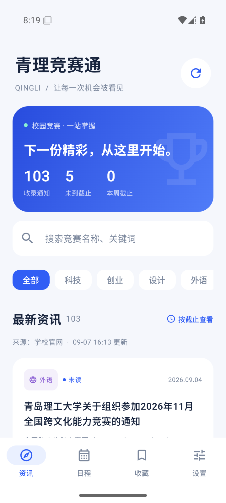

# 青理竞赛通

面向青岛理工大学学生的个人竞赛通知聚合工具，非学校官方应用。原生安卓客户端 + FastAPI 云端服务，无需注册，无广告。

## 下载与使用

- [下载 Android 安装包 v1.0.0](downloads/青理竞赛通-v1.0.0.apk)
- [中文使用说明](docs/使用说明.md)
- [测试与交付记录](docs/测试结果.md)



## 项目结构

- `android/`：Kotlin、Jetpack Compose、Room、DataStore、WorkManager 安卓工程。
- `backend/`：FastAPI、SQLite、定时官网采集、解析测试与真实页面样本。
- `compose.yaml`：独立服务容器与持久化数据卷。

## 安卓开发与构建

需要 JDK 17、Android SDK Platform 35 / Build Tools 35.0.0。Android Studio 打开 `android` 文件夹即可。Gradle Wrapper 固定为 8.11.1，AGP 为 8.9.2，Kotlin 为 2.1.20；依赖使用固定版本并配置 Maven 镜像以改善下载可用性。

```powershell
cd android
./gradlew.bat assembleDebug
./gradlew.bat lintDebug
```

Linux/macOS 可使用 `bash gradlew assembleDebug`。如未通过 Android Studio 配置 SDK，请设置 `ANDROID_HOME`，或在 `android/local.properties` 中指定 `sdk.dir`。

正式发布时，将独立签名备份包中的 `qingli-release.jks` 和 `signing.properties` 复制至 `android` 根目录，然后运行：

```powershell
./gradlew.bat assembleRelease
```

APK 位于 `android/app/build/outputs/apk/release/app-release.apk`。签名配置缺失时不会自动用调试签名冒充发布签名。升级时保持应用 ID `cn.qingli.competition` 和原签名，递增 `versionCode`。

Android 8.0（API 26）及以上可安装。默认服务地址在 `Data.kt` 的 `DEFAULT_SERVER` 中，也可在安装后的设置页面修改；地址验证成功后才保存。首次同步不推送历史通知，后台轮询默认间隔一小时，实际运行由安卓系统调度。收藏、已读和自定义日期保存在独立 Room 表中，官网更新不会覆盖它们。

## 后端部署

在已经安装 Docker 与 Docker Compose 的 Linux 服务器上，将本目录复制到 `/opt/qut-competition`：

```sh
cd /opt/qut-competition
docker-compose -p qut-competition -f compose.yaml up -d --build
curl http://127.0.0.1:18086/health
```

若系统使用 Compose 插件，将命令中的 `docker-compose` 替换成 `docker compose`。对外开放 TCP 18086 即可。API 只读，不提供公网管理写入接口。该版本通过 HTTP 传输公开通知数据；可在现有反向代理中增加 HTTPS 后修改 App 服务地址。

服务会在启动时自动同步，第一次约需一至两分钟，之后每小时扫描最新两页、每天北京时间 05:15 复查未到截止的通知。首次扫描约 100 条；列表上的已撤销页面跳过，图片或附件形式的通知正常收录。官网不提供完整中间证书链，项目补充从证书颁发机构取得的中间证书，保留正常的 TLS 主机名和根证书验证。

```sh
# 查看运行状态、日志
docker ps --filter name=qut-competition-api
docker logs --tail 80 qut-competition-api

# 手动同步最近约 100 条
docker exec qut-competition-api python -m app.manage sync --full

# 一致性数据库备份（可在运行时执行）
docker exec qut-competition-api python -m app.manage backup --output /data/backup.db
docker cp qut-competition-api:/data/backup.db ./qut-backup.db

# 更新源码之后重新构建
docker-compose -p qut-competition -f compose.yaml up -d --build
```

数据库在命名卷 `qut-competition_qut-data` 中，容器重建不会清空。不要执行 `down -v`，该命令会删除数据卷。恢复备份时应先停止本服务，再将备份作为 `notices.db` 放回数据卷，清理该数据库的旧 WAL/SHM 文件，保持 UID 10001 可读写，然后启动服务。

## API

| 路径 | 说明 |
| --- | --- |
| `GET /health` | 服务版本、时间、已收录条数 |
| `GET /api/v1/notices` | 通知列表，支持 `q`、`category`、`page`、`page_size`（1–100）、`updated_since`、`sync_before` |
| `GET /api/v1/notices/{id}` | 通知全文、来源、附件、图片与截止时间依据 |
| `GET /api/v1/sources` | 官网最近尝试/成功时间、同步状态、微信原文入口 |

分类取值：科技、创业、设计、外语、综合；不传分类返回全部。日期采用 ISO 8601，截止时间携带北京时间偏移。截止时间不能明确识别时为 `null`，不据此显示“报名中”。微信链接仅为外部入口，不宣称已自动采集公众号。

## 测试

```sh
cd backend
python -m pip install -r requirements.txt pytest
python -m pytest tests -q
```

本地直接运行后端可设置 `DATABASE_PATH=./data/notices.db`，然后执行 `uvicorn app.main:app --host 0.0.0.0 --port 8000`。测试会使用临时数据库并关闭定时任务。

连接安卓模拟器或开发设备后，在 `android` 目录运行 `./gradlew.bat connectedDebugAndroidTest`。界面集成测试使用当前云端真实通知，运行时需要网络，并会在测试安装中创建收藏记录。

## 数据与依赖

通知及图片、附件归原发布者所有，App 保留学校来源与原文入口。应用不收集账号、学号或联系方式；后端不保存个人收藏。第三方开源组件遵循各自许可证，构建时由 Gradle 和 pip 获取。正式签名材料单独保管，不在源码包中。
