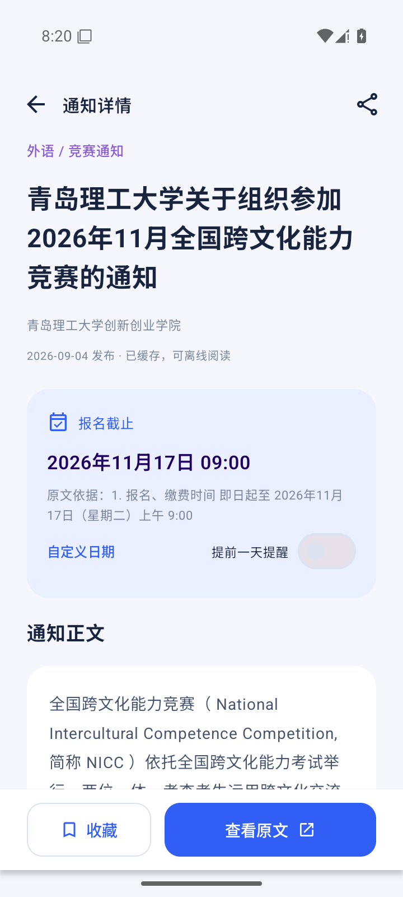
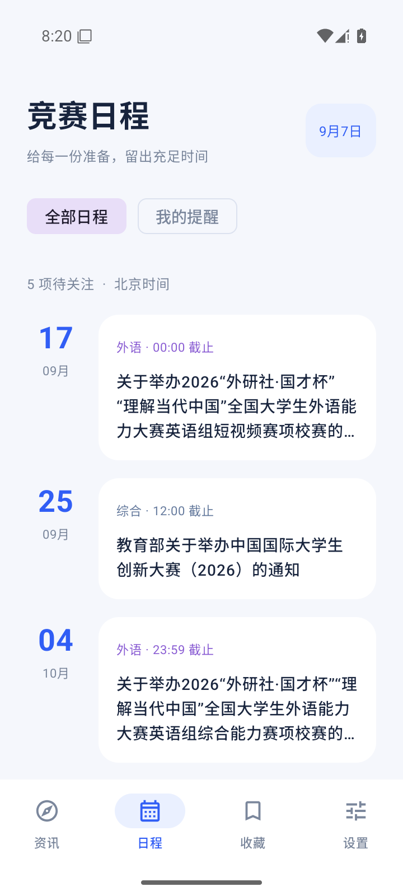

# 青理竞赛通 · 使用说明

这是为个人获取青岛理工大学竞赛信息制作的安卓应用。无需注册，安装后即可使用，后端已部署到你的服务器。

## 1. 安装与打开

1. 将 `青理竞赛通-v1.0.0.apk` 下载到安卓手机。
2. 在文件管理器中点击 APK。如系统提示，请允许当前浏览器或文件管理器“安装未知应用”，然后继续安装。
3. 打开“青理竞赛通”，连接网络，等待首次同步完成。
4. 初次同步不会推送一批历史消息。新通知提醒默认关闭，可在“设置”中开启。

支持 Android 8.0 及以上版本。交付的是已签名的正式 APK，无需安装开发工具。

服务地址已预置为 `http://38.207.179.218:18086`，日常使用不需要填写服务器账号或密码。首次打开需要网络；之后已缓存的通知正文可以离线阅读。

## 2. 五个主页面

| 页面 | 如何使用 |
| --- | --- |
| 资讯 | 查看最新通知；下拉或点击右上角刷新；搜索竞赛名称、正文关键词；筛选科技、创业、设计、外语、综合分类。 |
| 日程 | 查看尚未截止的竞赛，按截止时间排列；切换“我的提醒”查看已开启提醒的项目。 |
| 综测 | 学生用教务账号登录并上传材料；团支书用学工账号登录，查看本班注册进度，或打开管理端改分。 |
| 收藏 | 点击通知卡片或详情页的收藏按钮，之后可在这里快速找到。 |
| 设置 | 开关新竞赛通知、检查系统通知权限、测试连接、更换服务地址、查看同步时间与帮助。 |

“按截止查看”会列出有明确截止日期且尚未到期的通知。“截止时间待确认”不代表仍可报名，请打开详情核对原文。


## 3. 阅读、报名与附件

点击通知进入详情，可以查看学校来源、发布时间、正文、截止日期和提取该日期的原文依据。

- **查看原文**：在手机浏览器中打开学校原始通知，核对报名条件、群号和最新调整。
- **分享**：把标题和原文链接分享给同学。
- **图片和附件**：点击后通过原站点查看，需保持联网。仅图片或附件发布的通知不会猜测其中的截止时间。
- **收藏与已读**：保存在手机本地；官网再次同步不会覆盖收藏或自定义提醒日期。

应用帮助你发现信息；实际报名、提交作品和缴费按竞赛原文说明进行。



## 4. 设置截止提醒

1. 打开竞赛详情。
2. 查看“报名截止”日期，打开“提前一天提醒”。
3. 系统询问通知权限时选择允许。
4. 日期不明确或想安排自己的准备时间时，点击“自定义日期”，选择日期和时间。
5. 返回“日程 → 我的提醒”检查安排。

所有竞赛日期按北京时间显示。默认提前一天提醒；若设置时距离截止不足一天且尚未截止，会尽快提醒。已过期的日期不能新建提醒。同一截止时间不会反复通知。

新竞赛提醒和截止提醒分别控制。安卓系统省电、后台限制、断网或强制停止应用，可能延迟任务；打开 App 会尝试同步。“设置 → 系统通知权限”可以查看是否允许通知。



## 5. 数据来源和更新

主要来源为青岛理工大学创新创业学院的[通知公告栏目](https://chuangye.qut.edu.cn/index/sy/tzgg.htm)，以及竞赛通知 QQ 群。官网通知每小时检查最新两页，每天复查尚未到截止的通知。QQ 群消息会先按竞赛关键词过滤，再由服务器定期调用 AI 复核，确认后才会出现在资讯页，可按“QQ群”筛选。交付检查时官网已收录 **103 条**。

你提供的微信文章保存在“设置 → 微信参考文章”，作为外部原文入口。当前版本不自动采集公众号，也不覆盖其他学院网站的全部竞赛。

页面中的“官网更新”是服务器最近一次成功采集时间；“手机同步”是本机最近一次成功获取数据的时间。官网无法访问时会保留已有内容，并在后续同步时重试。

## 6. 常见问题

**安装后没有内容**：先确认联网，再点击刷新。进入“设置 → 测试连接”，正常会显示云端通知数量。

**测试连接失败**：确认服务器开机、Docker 服务正常，并且 TCP 18086 可从公网访问。当前地址为 `http://38.207.179.218:18086`。

**换了服务器**：在“设置 → 服务地址”填写新地址；连接测试成功后才会保存，已有本地收藏不会被清空。

**没有收到提醒**：检查系统通知权限，确认该竞赛的提醒开关已打开、日期尚未过期；必要时允许应用后台运行。应用不申请精确闹钟权限，因此通知可能延迟。

**日期显示待确认**：通知可能包含多阶段或多赛道日期，或者正文为图片、附件。请看原文，再自行设置提醒日期。

**重新安装后收藏没了**：收藏、已读和设置只保存在本机。卸载或清除应用数据会清除这些记录；使用相同签名直接升级通常可以保留。

## 7. 服务器维护

部署目录：`/opt/qut-competition`。容器名：`qut-competition-api`。数据库使用独立命名卷保存。以下命令在 SSH 登录服务器后执行，不是在手机中输入。

```sh
# 运行状态与最近日志
docker ps --filter name=qut-competition-api
docker logs --tail 80 qut-competition-api

# 手动同步
docker exec qut-competition-api python -m app.manage sync --full

# 备份数据库，再复制到当前目录
docker exec qut-competition-api python -m app.manage backup --output /data/backup.db
docker cp qut-competition-api:/data/backup.db ./qut-backup.db

# 替换源码后更新本服务
cd /opt/qut-competition
docker-compose -p qut-competition -f compose.yaml up -d --build

# QQ 机器人登录页（需扫码）：http://服务器:6099/webui
docker logs --tail 80 qut-competition-napcat
docker exec qut-competition-api python -m app.manage qq-poll
docker exec qut-competition-api python -m app.manage qq-review
```

普通容器重启或重建会保留数据库。不要使用 `docker-compose down -v`，该命令会删除数据卷。更详细的部署、恢复、API 和编译说明在源码包 `README.md` 中。

## 8. 交付文件

- `青理竞赛通-v1.0.0.apk`：手机安装包。
- `青理竞赛通-完整源码与部署.zip`：安卓工程、后端、Compose 配置、真实样本测试与开发说明。
- `青理竞赛通-签名备份.zip`：后续覆盖升级使用的签名密钥及配置，独立保管。
- `使用说明.md`、`使用说明.html`：本说明的两种阅读格式。
- `测试结果.md`：构建、签名、模拟器和云端验证记录。
- `screenshots/`：实际安卓界面截图。

源码、APK 和说明书均不包含服务器密码。个人信息聚合工具，非学校官方 App；通知与附件归原发布者所有。
